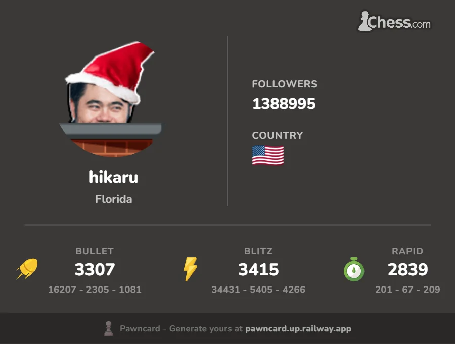
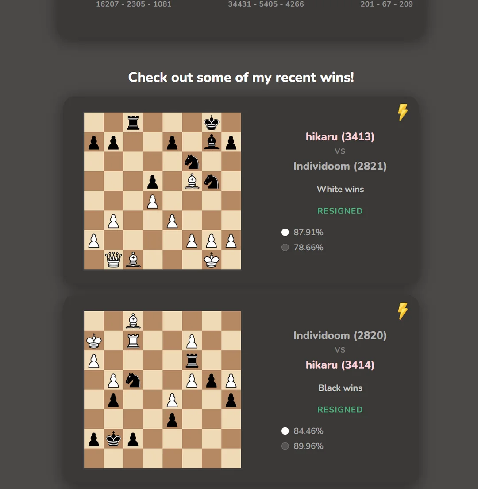

# Pawncard
A live chess.com social feed and profile card that builds itself as you play.

Just enter your chess.com username into the app, and get a profile card with your info and stats, as well as a highlight feed of your recent wins!

Try it out here: https://pawncard.up.railway.app

### Current Stats
**628 requests** across **195 unique accounts**

### Tech Stack
- FastAPI, Redis, AWS S3, Chess.com API, httpx
- JavaScript, HTML/CSS, chessboard.js
- Railway, boto3

### How it works
- Enter your chess.com username and the app queries the Chess.com API via a FastAPI backend
- A profile summary card is generated from your stats
- Your recent wins are stored as a persistent feed in AWS S3
- Redis caches responses for 2 minutes to prevent API abuse
